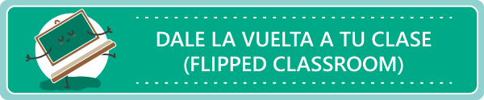

# Introducción

El curso **"Dale la vuelta a tu clase (Flipped Classroom)”** contribuye al desarrollo y mejora de la Competencia digital docente en todas sus áreas (Información y alfabetización informacional, Comunicación y colaboración, Creación de contenidos digitales, Seguridad y Resolución de problemas). En este curso se incide especialmente en las Áreas 2, Comunicación y colaboración, 3, Creación de contenidos digitales y 5, Resolución de problemas  del “**Marco Común de Competencia Digital Docente**”.

La realización del plan de actividades del curso te ayudará a alcanzar el nivel:

B1 de la competencia **2.4 Colaboración mediante canales digitales** contribuyendo a trabajar el siguiente descriptor: “Creo documentos o archivos de contenido educativo en un espacio en línea y los comparto con la comunidad educativas”.

B2 de la competencia **3.1 Competencia 3.1. Desarrollo de contenidos digitales**, contribuyendo a trabajar el siguiente descriptor:” Diseño, creo y edito imágenes, material icónico, vídeos y audios propios, tanto en local como en la nube, y los publico como parte de mi práctica docente”.

B2 de la competencia **3.2 Integración y reelaboración de contenidos digitales**, contribuyendo a trabajar el siguiente descriptor: “Planifico, diseño y elaboro recursos digitales educativos abiertos, a partir de otros, para su posterior utilización en mi práctica docente”.

B1 de la competencia **5.3. Innovación y uso de la tecnología digital de forma creativa**  contribuyendo a trabajar el siguiente descriptor:” Planifico y desarrollo actividades digitales para innovar mi metodología docente”.

A2 de la competencia **5.2 Identificación de necesidades y respuestas tecnológicas**, contribuyendo a trabajar el siguiente descriptor: " Sigo cursos tutorizados en línea, cuyo diseño instruccional es pautado y la atención tutorial, personalizada y continua”.

Este curso en red tiene como finalidad conocer el modelo Flipped Classroom (clase invertida) analizando su posible aplicabilidad, las ventajas de su desarrollo y los problemas o inconvenientes que nos podemos encontrar a la hora de llevarlo a la práctica detallando, a su vez, algunos estudios que abordan su eficacia.

Realizaremos un recorrido por más de 100 herramientas y recursos disponibles para ser utilizados, centrándonos en algunas de ellas, que exigirán la creación de contenidos didácticos “flipped” por parte del participante.

También reflexionaremos sobre la relación de este modelo con metodologías de tipo inductivo. Por tanto se trata de un enfoque eminentemente práctico que proporcione al alumno los conocimientos, recursos y herramientas para llevar este modelo a la práctica, de modo inmediato, en el contexto de su propia aula.