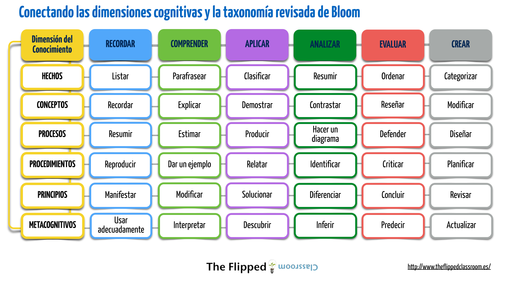

# Conectando dimensiones cognitivas y taxonomía

## Conectando las dimensiones cognitivas y la taxonomía revisada de Bloom

Hemos “cruzado” las dimensiones del conocimiento con los elementos de la taxonomía de Bloom revisada y hemos añadido las palabras clave, que en forma de verbos, nos pueden ayudar a definir el tipo de actividad cognitiva que el alumno va a desarrollar, bien ANTES o EN la CLASE. Esta matriz es el resultado:

Fuente de la imagen: [Blog The Flipped Classroom](http://www.theflippedclassroom.es/conectando-las-dimensiones-cognitivas-y-la-taxonomia-revisada-de-bloom/)

Guardar