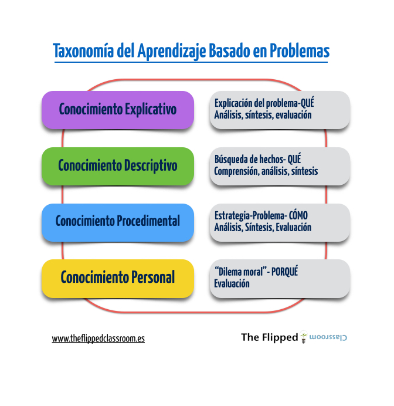

# FC y aprendizaje basado en problemas

## Taxonomía del Aprendizaje Basado en Problemas

Partiendo de esta reflexión personal:

*   ¿Utilizas el ABP en tus clases?
*   ¿Te has parado a pensar que cada actividad que diseñes o diseñen tus alumnos puede ir orientada a trabajar distintos niveles cognitivos?
*   Además de los niveles taxonómicos “clásicos”, ¿conoces los distintos tipos de aprendizaje?

Usaremos este gráfico, que nos puede ayudar a conectar todos estos elementos:

Fuente de la imagen: [Blog de Flipped Classroom](http://www.theflippedclassroom.es/un-poco-mas-sobre-la-taxonomia-del-aprendizaje-basado-en-problemas/)

Guardar