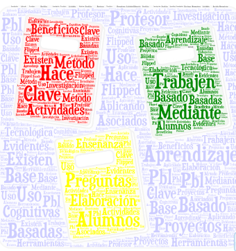

# FC y aprendizaje basado en proyectos

En el **aprendizaje basado en proyectos** (PBL), el profesor hace que los alumnos trabajen mediante la elaboración de:

1.  **preguntas clave**,
2.  las **actividades basadas en la investigación** y
3.  el uso de **herramientas cognitivas de base tecnológica** (Thomas, 2000).