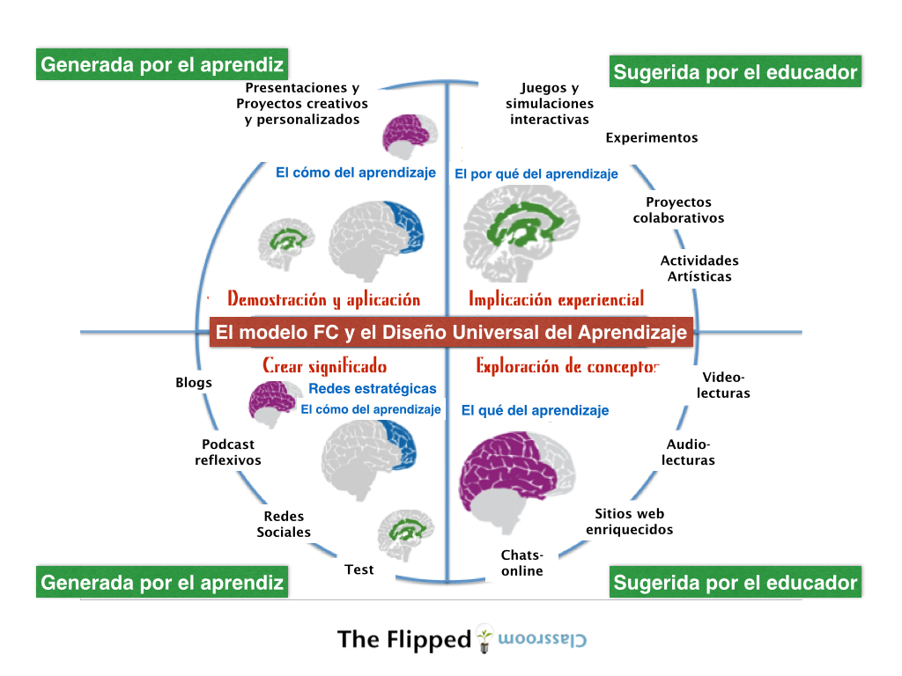
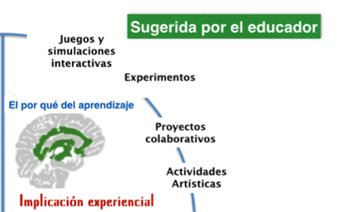
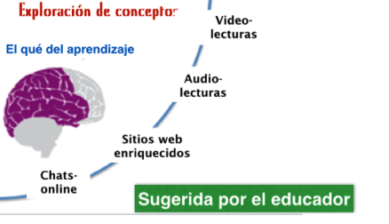
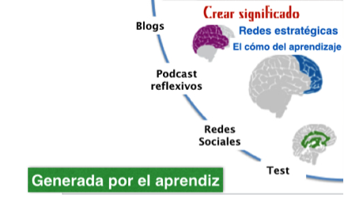
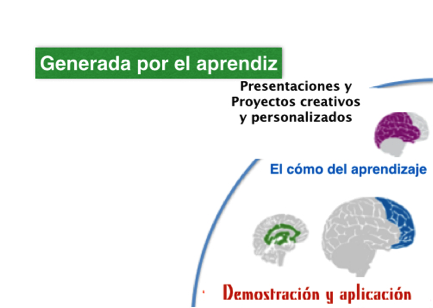

# Flipped Classroom y Diseño Universal del Aprendizaje: La conexión

Mencionaremos el concepto “Diseño Universal del Aprendizaje” (_UDL: Universal Design of Learning_) como una estrategia, un proceso que ofrece oportunidades para todos los estudiantes, no sólo los que tienen “necesidades especiales” (de hecho, todos los alumnos tienen diferentes necesidades), para llegar a explotar el máximo de sus capacidades, al menos, durante su permanencia en la escuela.

Lo que mostramos es cómo un modelo de aprendizaje experiencial, fundamentado en los principios del UDL incluye elementos del FC. Este gráfico es obra de Jackie Gerstein y ha sido adaptado desde su [blog](http://usergeneratededucation.wordpress.com/2012/05/29/udl-and-the-flipped-classroom-the-full-picture/).

 

Fuente de la imagen [Blog The flipped Classroom](http://www.theflippedclassroom.es/flipped-classroom-y-diseno-universal-del-aprendizaje-la-conexion-15/)

### **Implicación Experiencial**

El principio UDL  que se aborda en esta fase proporciona múltiples medios para el compromiso. El objetivo de esta etapa, en línea con los principios del aprendizaje experiencial, es enganchar o motivar al estudiante para que participe a nivel personal.

 

Fuente de la imagen [Blog The flipped Classroom](http://www.theflippedclassroom.es/flipped-classroom-y-diseno-universal-del-aprendizaje-la-conexion-15/)

Mediante la introducción de los estudiantes al tema de la lección y al contenido a través de actividades de aprendizaje auténticas, en acción, atractivas y ricas sensorialmente, se abordan las siguientes pautas fundamentales:

*   Proporcionar tareas que permitan la participación activa, la exploración y la experimentación.
*   Diseñar actividades para que los resultados del aprendizaje sean auténticos, comuniquen a un público real y reflejen un propósito que esté claro para los participantes.
*   Invitar a la respuesta personal, la evaluación y la autorreflexión hacia (sobre) los contenidos y actividades.
*   Incluir actividades que fomenten el uso de la imaginación para resolver problemas nuevos y relevantes, o den sentido a ideas complejas de manera creativa.
*   Crear grupos de aprendizaje cooperativo con objetivos claros, roles y responsabilidades, muchas de estas actividades requiere de aprendizaje cooperativo.

### **Exploración de conceptos.**

El principio UDL fundamental de esta etapa es: “Proporcionar múltiples medios de representación” Según lo propuesto por Flipped Classroom, esta es la fase donde los vídeos se utilizan para ayudar a los estudiantes en el aprendizaje de los conceptos teóricos relacionados con el contenido que se está cubriendo. Sin embargo, como se señaló anteriormente, los vídeos se utilizan para apoyar, introducir y reforzar los contenidos teóricos en lugar de ser su núcleo. Los vídeos no deben ser la única fuente de formación de conceptos. Para apoyar el aprendizaje, un ambiente multimedia debe proporcionar múltiples métodos de presentación. Este principio incluye materiales en gran variedad de [formatos](http://powerupwhatworks.org/page-puww/teacher-playlists) (en inglés). Los sitios web interactivos, libros electrónicos, simulaciones y sitios web ricos en contenido también puede servir a este fin. El alumno debe tener diferentes recursos para estudiar y aprender.

Fuente de la imagen [Blog The flipped Classroom](http://www.theflippedclassroom.es/flipped-classroom-y-diseno-universal-del-aprendizaje-la-conexion-15/)

Estas son algunas pautas de “Proporcionar múltiples medios de representación”:

*   Presentar los conceptos clave en una forma de representación simbólica (por ejemplo, un texto expositivo o una ecuación matemática) con una vía alternativa (por ejemplo, una ilustración, danza/movimiento, diagrama, tabla, modelo, vídeo, cómic, guión, fotografía, animación, físico o virtual de manipulación.)
*   Proporcionar diagramas visuales, gráficos, o muestras de música o sonido para apoyar el contenido auditivo y la información.
*   Proporcionar descripciones (de texto o de voz) para todas las imágenes, gráficos, vídeo o animaciones.
*   Proporcionar modelos interactivos que guíen la exploración y nuevos entendimientos.
*   Proporcionar múltiples puntos de entrada para una lección y vías opcionales a través de contenido (por ejemplo, la exploración de las grandes ideas a través de obras de teatro, las artes y la literatura, el cine y los medios de comunicación.)

### **Creando significado.**

El principio UDL fundamental durante esta fase es “Proporcionar medios múltiples de acción y expresión” Los estudiantes, durante esta fase, construyen sus propios conocimientos a partir de las experiencias, los contenidos y los temas tratados en las fases anteriores. Lo hacen a través de blogs, podcasts, videocasts, VoiceThread, Edmodo, wikis y otras herramientas web 2.0 que permiten la reflexión y la expresión personal. Un entorno digital es compatible con el aprendizaje del estudiante cuando proporciona múltiples métodos flexibles para la actuación, la expresión y el aprendizaje. Al igual que con la presentación de contenidos, se deben ofrecer varias opciones al estudiante.

Fuente de la imagen [Blog The flipped Classroom](http://www.theflippedclassroom.es/flipped-classroom-y-diseno-universal-del-aprendizaje-la-conexion-15/)

Las siguientes directrices relacionadas con “Proporcionar múltiples medios de acción y de expresión” se abordan cuando los alumnos construyen sus conocimientos de los contenidos:

*   Utilizar los medios sociales y las herramientas web interactivas (por ejemplo, foros de discusión, chats, diseño web, herramientas de anotación, guiones gráficos, tiras cómicas, las presentaciones de animación.)
*   Redactar en múltiples medios de comunicación, tales como texto, discurso, dibujo, ilustración, cómics, storyboards, diseño, cine, música, arte visual, escultura o vídeo.
*   Uso de aplicaciones web (por ejemplo, wikis, animaciones, presentaciones.)
*   Utilizar las redes de cuentos, herramientas para resumir / marcar ideas claves o herramientas de mapas conceptuales. 

### **Demostración y aplicación: El  _¿Ahora qué?_**

Durante esta fase, los alumnos demuestran lo que han aprendido en las etapas anteriores, y cómo este aprendizaje se trasladará a otras áreas de su vida. El principio UDL más importante que se abordará durante esta fase es “Proporcionar múltiples medios de acción y de expresión”:

*   Redactar en múltiples medios, tales como texto, el dibujo, la ilustración, el diseño, el cine, la música, la danza/movimiento, arte visual, la escultura o el vídeo.

Fuente de la imagen [Blog The flipped Classroom](http://www.theflippedclassroom.es/flipped-classroom-y-diseno-universal-del-aprendizaje-la-conexion-15/)

También tendrán en cuenta las siguientes pautas de “Proporcionar múltiples medios para la acción”:

*   Proporcionar al alumnado la discreción y autonomía posible, ofreciéndoles opciones.
*   Permitir a los alumnos que participen en el diseño de las actividades de la clase y las tareas académicas.
*   Variar las actividades y fuentes de información para que puedan ser personalizadas y contextualizadas en la vida de los estudiantes.
*   Diseñar actividades para que los resultados del aprendizaje sean auténticos, comuniquen a un público real, y reflejen un propósito que esté claro para los participantes.
*   Proporcionar tareas que permitan la participación activa, la exploración y la experimentación.
*   Incluir actividades que fomentan el uso de la imaginación para resolver problemas nuevos y relevantes, o den sentido a ideas complejas de manera creativa.
*   Variar los grados de libertad para un rendimiento aceptable.
*   Los “Múltiples medios de representación” también se ven reforzados durante esta fase de demostración y aplicación; mientras se les pida a los estudiantes que incorporen oportunidades explícitas de revisión y práctica.
*   Tomarán las oportunidades a través del tiempo para revisar los puntos clave y los vínculos entre las ideas.

