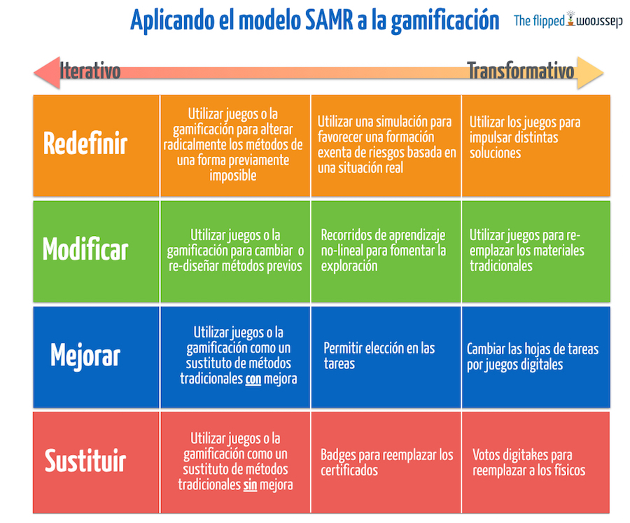
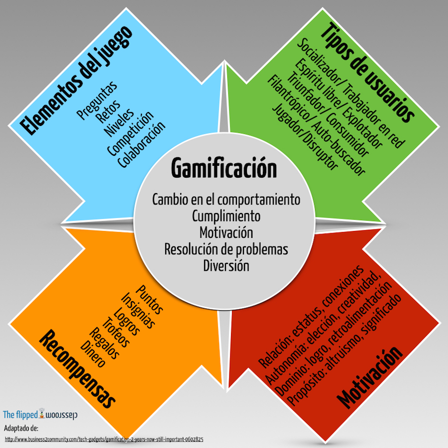
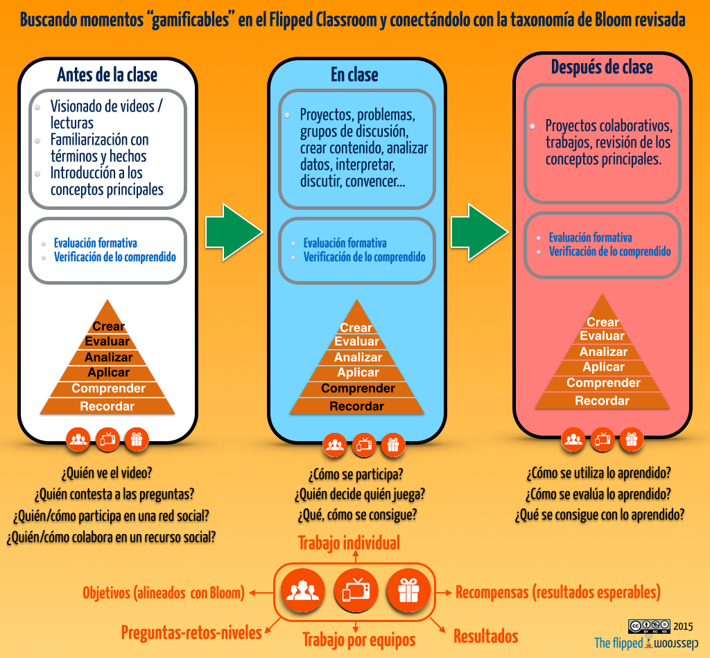
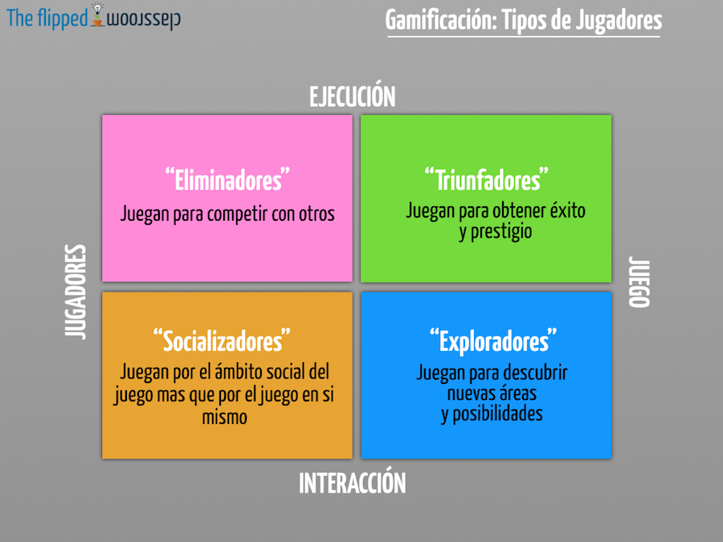

# Infografías sobre Gamificación

## Gamificación y modelo SAMR: de la sustitución a la transformación:

Fuente de la imagen: [Blog The Flipped Classroom](http://www.theflippedclassroom.es/3-infograficos-sobre-gamificacion/)

## Gamificación: un análisis

Fuente de la imagen: [Blog The Flipped Classroom](http://www.theflippedclassroom.es/4-infograficos-sobre-gamificacion-12/)

## Buscando momentos gamificables

  

Fuente de la imagen:[ Blog The Flipped Classroom](http://www.theflippedclassroom.es/4-infograficos-sobre-gamificacion-12/)

## Tipos de jugadores

Fuente de la imagen: [Blog The Flipped Classroom](http://www.theflippedclassroom.es/3-infograficos-sobre-gamificacion/)