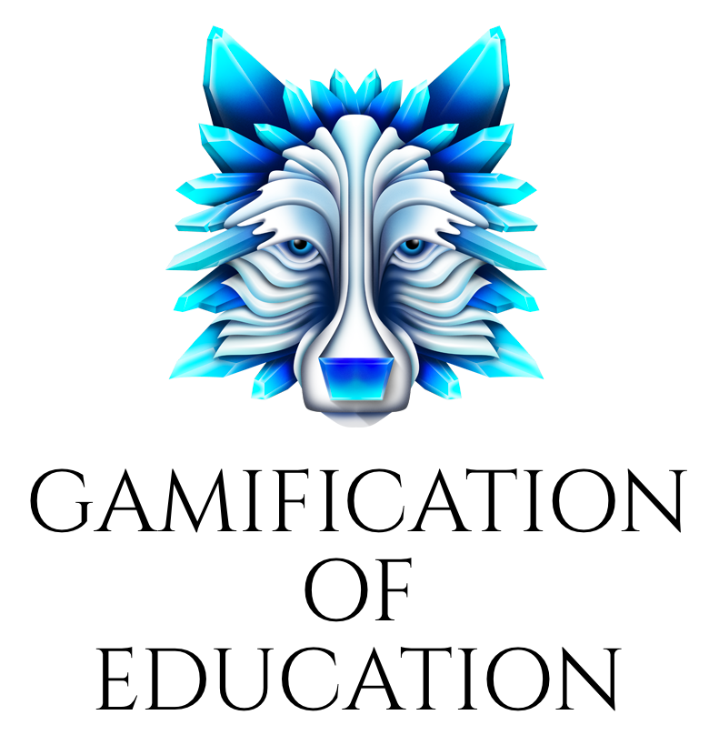

# ¿Jugamos? La Gamificación

## 8 cosas que debes saber sobre el juego y la pedagogía

### 1\. ¿Qué es?

Los educadores hemos entendido desde hace tiempo que la dinámica interactiva de juegos tiene el potencial de beneficiar a la enseñanza y el aprendizaje, y en los últimos años se ha producido una considerable actividad en torno al uso de la mecánica del juego en la educación superior. Los esfuerzos para utilizar este tipo de actividades con el fin de mejorar el aprendizaje incluyen la superposición de elementos de juego en un curso, la creación de actividades de juego que ofrecen contenido, y, en algunos casos, la estructuración de un curso entero como un juego. El resultado es una matriz diversa de enfoques que utiliza los principios del juego, juegos completamente desarrollados, u otros aspectos de lo que algunos describen como “aprendizaje gameful” para aumentar la participación, mejorar el aprendizaje y explorar nuevos modelos educativos.

### 2\. ¿Cómo funciona?

Los principios del juego pueden crear una dinámica atractiva que inspire a los estudiantes a desarrollar competencias y habilidades a medida que se centran en las actividades de juego. Esto es tan cierto, para los elementos de juego a pequeña escala, como lo es para los juegos independientes. Tales estructuras pueden funcionar como actividades de aprendizaje individuales, actuar como un mecanismo de entrega de contenido de gran alcance en varias sesiones de clase, o extenderse a lo largo de todo un curso. Con una sola sesión, los elementos del juego podrían ser mínimos, ya que los puntos se ganan por las respuestas correctas dadas durante la discusión en clase. En una aplicación más amplia, el programa puede ser dividido en “niveles” donde los estudiantes comiencen en el nivel más bajo y trabajen con de una serie de desafíos con miras a progresar antes de que termine el curso. La crítica de rendimiento de los estudiantes podría retroalimentarse, y los estudiantes tendrían la oportunidad de volver sobre sus pasos, encontrar dónde se equivocaron, y volver a intentarlo hasta que lo consigan. De esta manera, los estudiantes entienden que los múltiples intentos hacia un objetivo deseado son una parte integral del aprendizaje. Para ser eficaz en la educación, el aprendizaje y desarrollo de habilidades, la mecánica del juego se debe alinear con los resultados de aprendizaje deseados. El uso de juegos en el aprendizaje podría no ser competitivo en un sentido convencional; de hecho, podrían exigir a los estudiantes trabajar juntos para resolver problemas. En otros contextos, la mecánica de juego animaría a los estudiantes a competir contra sí mismos, buscando alcanzar una mejor marca personal o para satisfacer sus propias metas de aprendizaje.

### 3\. ¿Quién lo hace?

Los juegos y las mecánicas de juego son cada vez más empleados en los colegios y universidades. En la Universidad de Temple Fox School of Business, los estudiantes que estudian Social Media Innovation pueden ganar puntos e insignias en una tabla de clasificación. Los puntos se conceden por escribir entradas de blog y con la participación en ejercicios de WordPress. El juego se ha ido perfeccionando con el tiempo, y los ex alumnos escriben para decir que el juego ayudó a retener información. En la Universidad de Michigan, un proyecto, que fue desarrollado originalmente para un curso de pregrado de videojuegos, se ha convertido en un sistema de gestión de aprendizaje llamado GradeCraft. El sistema utiliza las estrategias de juego para animar a la participación de los estudiantes y motivarles, y les proporciona datos y análisis para su información y orientación. GradeCraft también se ha utilizado en otros cursos de la universidad, incluyendo un curso de Introducción a la Teoría Política y uno en Ciencias de la Información.

### 4\. ¿Por qué es importante?

Incluso unos elementos de juego simples atraen a los estudiantes al contenido del curso. La mecánica de juegos más complejos pueden despertar la motivación a través de la adquisición de puntos o la satisfacción personal de aprender cosas que pueden aplicar fuera de la actividad. Al participar en este tipo de actividades, los estudiantes adquieren información y perfeccionan habilidades a la vez que logran objetivos intermedios que proporcionan un sentido claro de progreso, en vez de centrarse simplemente en completar el curso. La mecánica del juego refuerza el hecho de que el fracaso no es ni un retroceso ni un resultado, sino más bien una indicación de que se necesita más trabajo para dominar la habilidad o el conocimiento. A través de pasos discretos que conducen a un objetivo de mayor importancia, los estudiantes pueden ver la interrelación entre la táctica y la estrategia. Comienzan a entender el procedimiento, el proceso y el valor de los caminos alternativos. El resultado podría ser volverles pensadores más seguros e independientes que están más preparados para asumir proyectos de gran envergadura y cargar con ellos hasta el final.

### 5\. ¿Cuáles son las desventajas?

Mientras que los juegos podrían tener un lugar natural en la pedagogía, su atractivo no es universal. Para algunos, los juegos tienen una connotación de ocio seguro y diversión en lugar de unidad académica, lo que puede ser una desventaja para algunos educadores. Los estudiantes también pueden tener objeciones. Los que no se dedican a la actividad de juego puede sentirse cohibidos en dicho entorno. Los instructores pueden tener dificultades para alinear la dinámica de juego con la de los objetivos de aprendizaje del curso. Para ser eficaz como un modelo educativo, el ejercicio debe cumplir con un objetivo de aprendizaje definido a la vez que es atractivo y divertido.

### 6\. ¿Hacia dónde va?

Un enfoque basado en el juego para el aprendizaje es una de las diversas tendencias en la educación superior. Como los colegios y universidades se mueven hacia una alineación más cercana con las expectativas del lugar de trabajo, simulaciones del entorno de trabajo podrían servir como evaluaciones de la educación basada en las competencias. El uso de la mecánica de juego tiene el potencial no solo de una herramienta para la enseñanza, sino que también sirve para evaluar el aprendizaje, que podría ser formal o informal, o estar basado en la experiencia de aprendizaje, proporcionando un mayor apoyo a un mayor número de estudiantes. Otro movimiento en la educación superior es, en muchos sentidos, un paso natural para el juego, como una forma de marcar y reconocer el progreso. Mientras tanto, se espera ver un incremento de los juegos educativos en los dispositivos móviles, los cuales permiten a los estudiantes participar más fácilmente en las actividades de juego y, en algunos casos, que lo hagan en el mundo real, mejorando aún más el compromiso y el aprendizaje.

### 7\. ¿Cuáles son las implicaciones para la enseñanza y el aprendizaje?

La aplicación de los principios y estructuras de juegos para el aprendizaje puede ayudar a los alumnos de una manera que la mayoría de las formas tradicionales de enseñanza no puede. Los juegos pueden ser altamente motivantes y atractivos para los estudiantes, y tienen el potencial de demostrar, tanto a alumnos y profesores, que el aprendizaje puede medirse no solo con notas, sino con competencias. Cuando las actividades de juego están diseñadas en torno a equipos, se construyen habilidades de colaboración. Todo el mundo ha jugado a juegos por diversión, y ese tipo de actividades en un entorno académico elimina la brecha que normalmente separa las tasas de los juegos de aprendizaje. También muestra que el aprendizaje es un proceso de ensayo y error, de repetición y práctica, y de un avance gradual hacia metas más grandes. En todos estos aspectos, el uso de juegos en el aprendizaje puede ser tan influyente para instructores como para estudiantes.

### 8\. ¿Cuál es su relación con el modelo Flipped? 

La aplicación de actividades y estrategias de gamificación en el aula puede constituir un aliciente y una motivación adicional para trabajar los contenidos previamente en casa.

Fuente de la imagen: Elaboración propia by [Notegraphy](https://notegraphy.com)