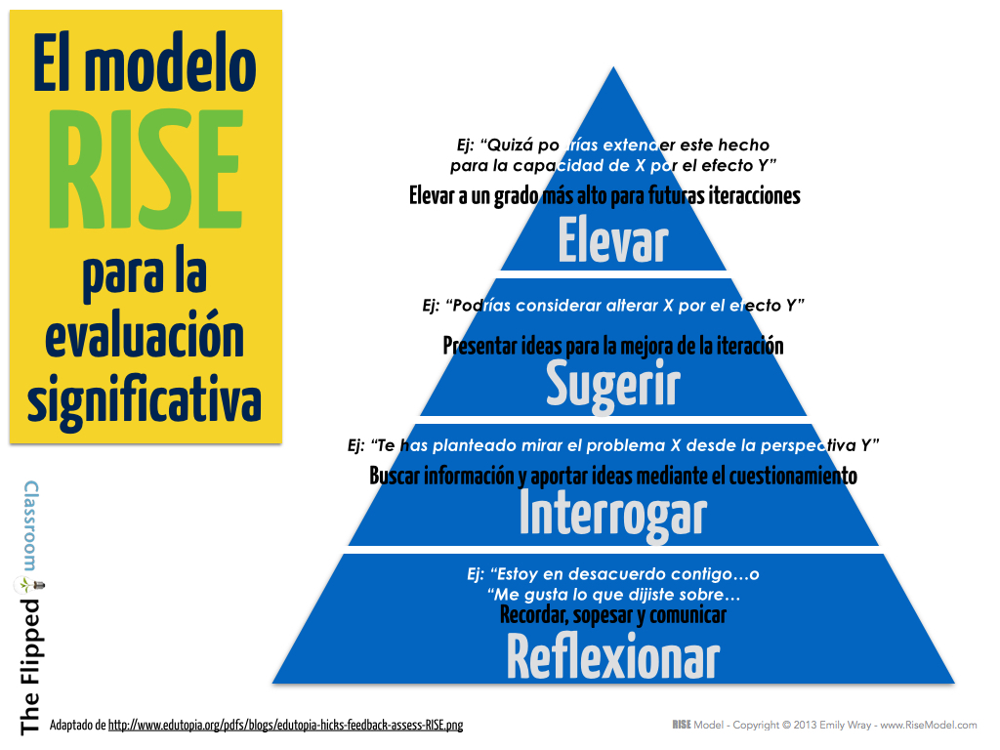

# La importancia de la evaluación

## El modelo RISE para la evaluación significativa

El hecho de poder proporcionar a los estudiantes información sobre sus trabajos escritos supone habitualmente una alta carga de trabajo.

Aún así, sabemos, tanto de nuestras experiencias y de la propia investigación, que la retroalimentación es esencial. [John Hattie](https://en.wikipedia.org/wiki/John_Hattie), Profesor de Educación y Director del Instituto de Investigación de Educación en la Universidad de Melbourne, cree que la retroalimentación debe ser oportuna, pertinente y orientada a la acción. Este gráfico, basado en la Taxonomía de Bloom, nos puede ayudar a comprender este modelo:

Fuente de la imagen: [Blog The Flipped Classroom](http://www.theflippedclassroom.es/el-modelo-rise-para-la-evaluacion-significativa/)

Guardar