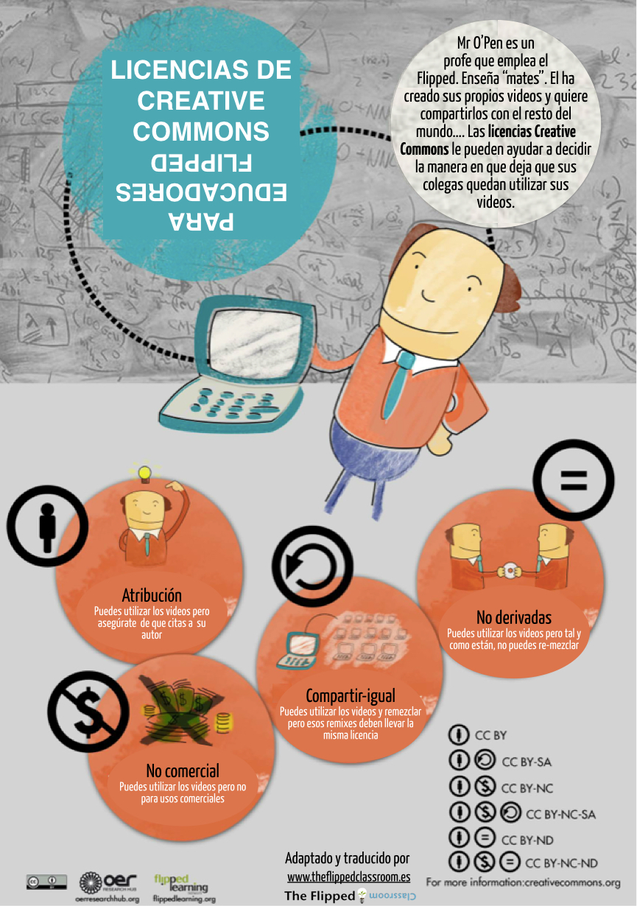

# La importancia de las licencias Creative Commons

Cuando buscamos material, lo modificamos o lo empleamos, debemos tener en cuenta que pueden estar bajo una licencia Creative Commons. Debemos ser muy escrupulosos con este tema, tanto nosotros como nuestros estudiantes a los que les debemos hacer conscientes de que no "todo vale" cuando trabajamos obras y creaciones de otras personas.

[**Creative Commons** (CC)](http://es.creativecommons.org/blog/) (en español equivaldría a: “\[Bienes\] Comunes Creativos”) es una **organización sin ánimo de lucro**, cuya oficina central está ubicada en la ciudad de Mountain View, en el estado de California, en los Estados Unidos de América. Dicha organización **permite usar y compartir tanto la creatividad como el conocimiento a través de una serie de instrumentos jurídicos de carácter gratuito**.

Dichos instrumentos jurídicos consisten en **un conjunto de “modelos de contratos de licenciamiento” o licencias de derechos de autor (**licencias Creative Commons o licencias “CC”) que **ofrecen al autor de una obra una forma simple y estandarizada de otorgar permiso al público en general de compartir y usar su trabajo creativo bajo los términos y condiciones de su elección.** En este sentido, las licencias Creative Commons permiten al autor cambiar fácilmente los términos y condiciones de derechos de autor de su obra de “todos los derechos reservados” a “algunos derechos reservados”.

[Creative Commons CPJV](https://www.youtube.com/watch?v=OUo3KMkOETY)  [Consejo Provincial Juventud de Valladolid](https://www.youtube.com/channel/UC0TT_HYBTJ7Zcv0tBcdF98A)

Las licencias Creative Commons no reemplazan a los derechos de autor, sino que se apoyan en estos para permitir modificar los términos y condiciones de la licencia de su obra de la forma que mejor satisfaga sus necesidades.

No olvides licenciar adecuadamente tus vídeos para que otros puedan usarlos de acuerdo con las leyes de propiedad intelectual. En la [ayuda de Youtube](https://support.google.com/youtube/answer/2797468?hl=es) puedes ver las condiciones de las licencias en esta plataforma. En la [ayuda de Vimeo](https://vimeo.com/help/faq/legal-stuff/creative-commons#what-do-the-different-creative-commons-licenses-mean) puedes ver las licencias de las que disponen para los vídeos alojados en esta otra plataforma.

## Más sobre licencias

En el Espacio de [Apoyo TIC](http://formacion.educalab.es/mod/imscp/view.php?id=14762) encontrarás contenido específico sobre licencias muy completo, échale un vistazo si quieres ampliar en este tema.