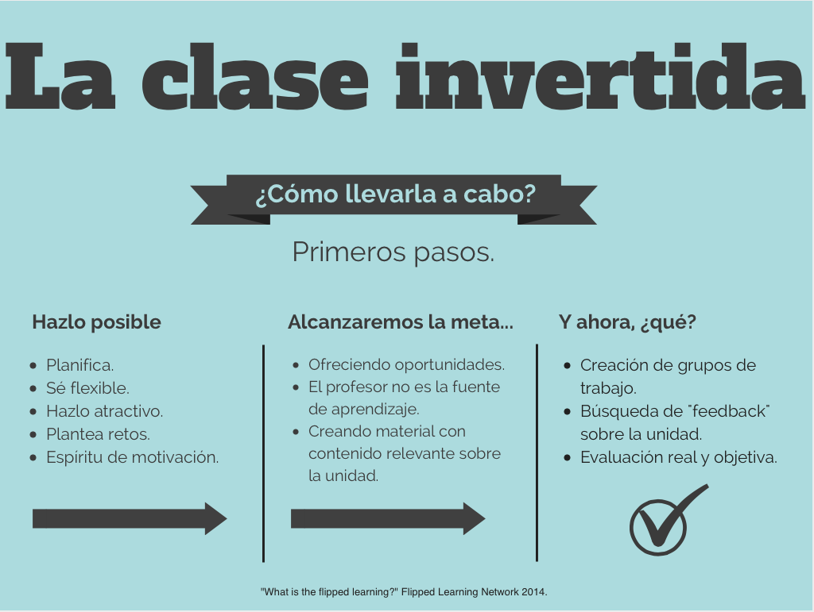

# Los cuatro Pilares del Flipped Classroom

En el [último número](http://fln.schoolwires.net/cms/lib07/VA01923112/Centricity/Domain/46/FLIP_handout_FNL_Web.pdf) de The Flipped Learning Network (12 de marzo de 2014), incluye un PDF que detalla una definición concreta del Flipped Learning y los “cuatro pilares” que lo sustentan. Resumimos aquí lo mas relevante de ese documento.

Para contrarrestar conceptos erróneos comunes y ofrecer los educadores un marco práctico para el FL , la junta de gobierno y los principales dirigentes de la Red de Aprendizaje Flipped (FLN) ha anunciado hoy una definición formal del término. Según Aaron Sams, miembro de la junta FLN y coautor de “_Flip Your Classroom:_ _Reach Every Student in Every Class Every Day”_,_ “Uno de los mayores malentendidos es que el principal componente de FL es el uso del video \[...\] Aunque el vídeo es un importante componente de Flipped Learning, el beneficio más valioso es el mejor uso del tiempo de clase para que los estudiantes participen en actividades que impliquen el desarrollo de estrategias de __aprendizaje de nivel superior.”  
_

La definición del Flipped Learning es la siguiente: “El Flipped Learning es un enfoque pedagógico en el que la instrucción directa se mueve desde el espacio de aprendizaje colectivo hacia el espacio de aprendizaje individual, y el espacio resultante se transforma en un ambiente de aprendizaje dinámico e interactivo en el que el educador guía a los estudiantes a medida que se aplican los conceptos y puede participar creativamente en la materia“.

Junto con la definición, la FLN anunció los cuatro pilares del FL y una lista de 11 indicadores de apoyo para los educadores. Jon Bergmann, coautor de “Flip Your Classroom”, secretario y tesorero de la FLN, con respecto a la lista de “verificación” afirmó: _“Los educadores pueden utilizarlo como un marco de referencia, ya que puede ayudar a determinar la eficacia del modelo. Se trata de una “hoja de ruta” que contiene los principios de Flipped Learning.“_

### Los cuatro Pilares del FLN son los siguientes:

#### Entorno flexible

Los educadores crean espacios adaptables donde los alumnos eligen cuándo y dónde aprenden. Además, los educadores que invierten sus clases, son flexibles en sus expectativas en los tiempos de aprendizaje y en la evaluación de los estudiantes.

#### Cultura de aprendizaje

El modelo de aprendizaje Flipped cambia deliberadamente la instrucción hacia un enfoque centrado en el alumno, en el que el tiempo de clase se dedica a explorar los temas con mayor profundidad y crear más oportunidades de aprendizaje. Los estudiantes participan activamente en la construcción del conocimiento, ya que participan y evalúan su aprendizaje de una manera que puede ser personalmente significativa.

#### Contenido intencional

Los educadores piensan continuamente sobre cómo pueden utilizar el modelo FL para ayudar a los estudiantes a desarrollar la comprensión conceptual y la fluidez de procedimiento. Los profesores emplean contenido intencional para maximizar el tiempo de clase con el fin de adoptar métodos y estrategias activas de aprendizaje centrados en el estudiante.

#### Educador Profesional

Los educadores profesionales observan continuamente sus alumnos, proporcionándoles retroalimentación relevante en cada momento así como evaluación de su trabajo. Los educadores profesionales son reflexivos en su práctica, interactúan entre sí para mejorar la calidad de su docencia, aceptan la crítica constructiva y toleran el “caos controlado en sus aulas”.

# Infográfico

Fuente de la imagen Elaboración propia a través del texto "[What is the flipped learning](http://fln.schoolwires.net/cms/lib07/VA01923112/Centricity/Domain/46/FLIP_handout_FNL_Web.pdf)" FLN