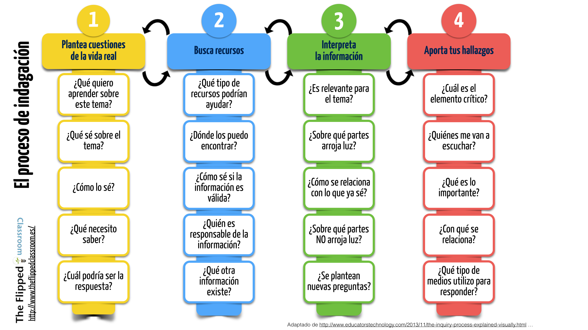

# Preguntas clave en un proceso de indagación

## ¿Cuáles pueden ser las preguntas clave en un proceso de indagación?

El aprendizaje es sobre todo un camino para fomentar la curiosidad y la indagación. Es un proceso en el que los estudiantes exploran lo desconocido a través de sus sentidos tanto a través de habilidades sensoriales como motoras.

Estar involucrado y comprometido en la tarea de aprendizaje es la clave para un viaje de aprendizaje de calidad y para obtener este tipo de compromiso por parte de los alumnos, los profesores necesitan para ello generar un ambiente de aprendizaje donde los estudiantes asumen la responsabilidad de su aprendizaje. Tal entorno sin duda requiere de un enfoque sólido y una estrategia sólida: el aprendizaje basado en la indagación.

El **aprendizaje basado en la indagación** es esencial para el desarrollo de las habilidades: la resolución de problemas y el empleo del pensamiento creativo.

En la siguiente infografía podemos encontrar algunas** claves** para llevarlo a buen término.

Fuente de la imagen: [Blog The Flipped Classroom](http://www.theflippedclassroom.es/cuales-pueden-ser-las-preguntas-clave-en-un-proceso-de-indagacion/)

Guardar