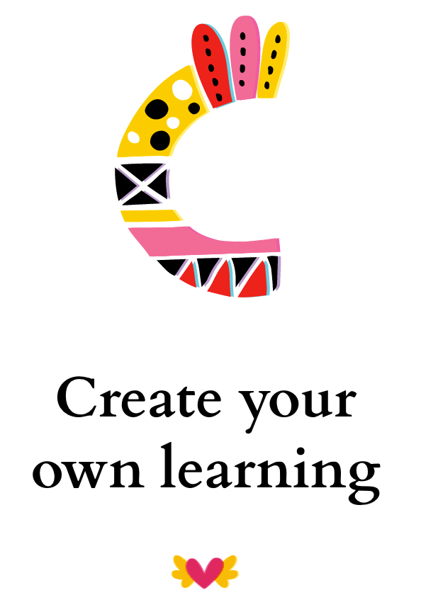
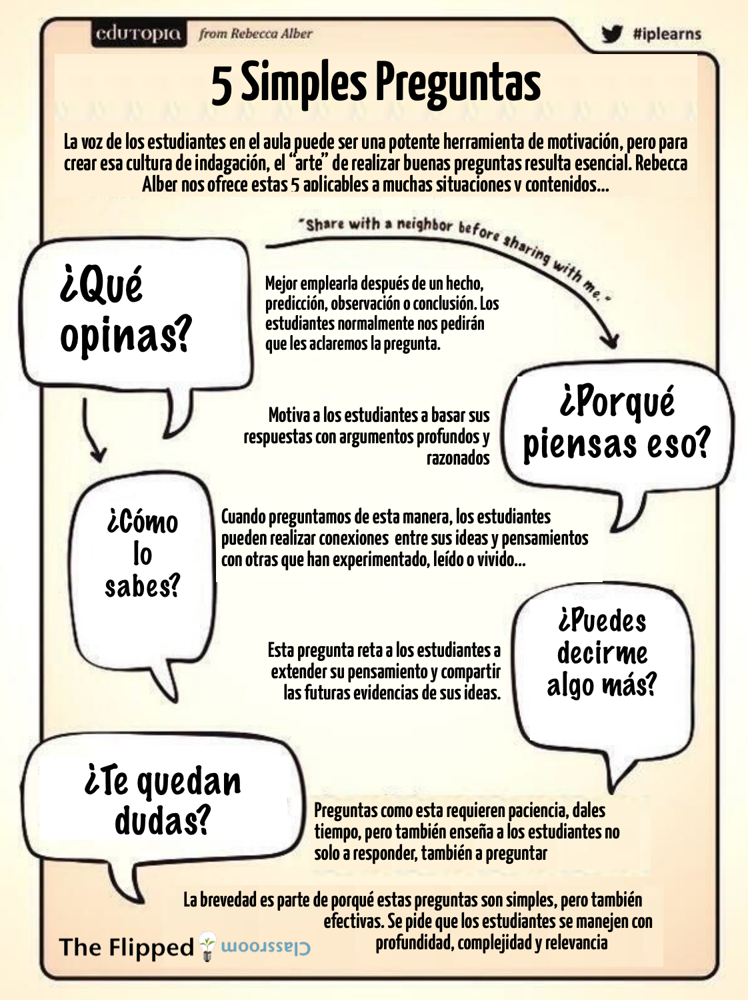

# ¿Sabes lo que es la Enseñanza Orientada a la Acción y su relación con el Flipped Learning?

La **Enseñanza orientada a la acción** responde a un enfoque didáctico integral que presupone específicamente la actividad del alumno. La organización del proceso de aprendizaje encuentra su orientación en los “productos de la acción” acordados entre el docente y los alumnos. El resultado de este proceso de aprendizaje debe ser un equilibrio entre “la cabeza, el corazón y la mano”([Johann Heinrich Pestalozzi](http://es.wikipedia.org/wiki/Johann_Heinrich_Pestalozzi),1746-1827), es decir el aprendizaje cognitivo, afectivo y psicomotor. No se trata de un modelo, sino simplemente de un concepto didáctico.

Este concepto “se puede vestir con muchos trajes distintos”:

*   **Aprendizaje Experiencial**: El Dr. Jackie Gerstein ha profundizado mucho sobre este tema, y ha [desarrollado un excelente modelo visual](http://usergeneratededucation.files.wordpress.com/2011/06/experience.jpg) que sintetiza los beneficios del aprendizaje experimental como parte de un modelo FC. Este artículo, [“Flipped Classroom: Visión global de la Educación Superior” (en inglés)](http://usergeneratededucation.wordpress.com/2012/05/15/flipped-classroom-the-full-picture-for-higher-education/), se centra en cómo esta construcción puede ser desarrollada en el entorno de la educación superior. Para Gerstein, un enfoque FC se inicia con la presentación de un tema antes del “consumo” de los contenidos de aprendizaje, y el ciclo se completa con actividades de aprendizaje constructivistas.
    

*   **Aprendizaje Basado en la Investigación**: En el artículo, [“The Flip: ¿Por qué me encanta, ¿Cómo lo uso”, (en inglés)](http://blogs.kqed.org/mindshift/2011/07/the-flip-why-i-love-it-how-i-use-it/) Shelley Wright explica: “_Yo no creo simplemente en la asignación de videos como un sustituto de mi propia docencia_“.  Una vez más vemos que buen enfoque FC debe incluir un ciclo completo de aprendizaje en el que las nuevas ideas son discutidas en el aula y después, se pide a los estudiante que trabajen un contenido digital relacionado. No hacerlo es un motivo frecuente de errores y carencias potenciales en bastantes experiencias FC.

*   **Aprendizaje Basado en Proyectos**: [En este Video](http://www.edutopia.org/salman-khan-academy-flipped-classroom-video), Sal Khan argumenta cómo se trabaja en un modelo FC, liberando tiempo de clase para el ABP. Para aprender más sobre esta metodología, puedes ampliar información del [Aprendizaje Basado en Proyectos de Edutopia](http://www.edutopia.org/project-based-learning). Se hace hincapié en la aplicación práctica de los contenidos académicos, para reforzar las actividades y conducir eficientemente al estudiante a través de todo el ciclo de aprendizaje.

*   **Aprendizaje Basado en Problemas:** [En este artículo en el sitio Weebly “The Sandbox Digital”](http://digitalsandbox.weebly.com/scaffolding-flipped-classrooms.html), del profesor y el director Mike King explica cómo, el “Aprendizaje Basado en Problemas" en un modelo FC se centra en la presentación de un problema, no simplemente en las lecturas, tareas o ejercicios. Desde que la “adquisición de los contenidos” no es el centro del aprendizaje, la clase se convierte en un centro activo de descubrimiento, mediante el uso del contenido como un apoyo para resolver un problema". [Más información sobre esta metodología](http://es.wikipedia.org/wiki/Aprendizaje_basado_en_problemas).  
    

*   **Constructivismo:** La [Universidad de Oregon propone](http://otec.uoregon.edu/learning_theory.htm#Constructivism) esta definición, “_el aprendizaje constructivista se basa en la participación activa de los estudiantes en la resolución de problemas y el pensamiento crítico en relación con una actividad de aprendizaje que encuentran relevante y atractiva_. Ellos están “construyendo” su propio conocimiento … “. Por su parte, en [este artículo del profesor Mark Isero](http://iserotope.com/educational-theory-a-move-toward-constructivism/) argumenta brevemente la relación entre el constructivismo y el FC. “La idea es simple: c_onstruir conocimientos juntos en el aula, en lugar de hacer que los estudiantes lo hagan en casa_“.

Fuente de la imagen: Elaboración propia by [Notegraphy](https://notegraphy.com)

Guardar

Guardar

# 5 simples preguntas para dinamizar el aprendizaje

Fuente de la imagen: [Blog The Flipped Classroom](http://www.theflippedclassroom.es/5-simples-preguntas-para-dinamizar-el-aprendizaje/)