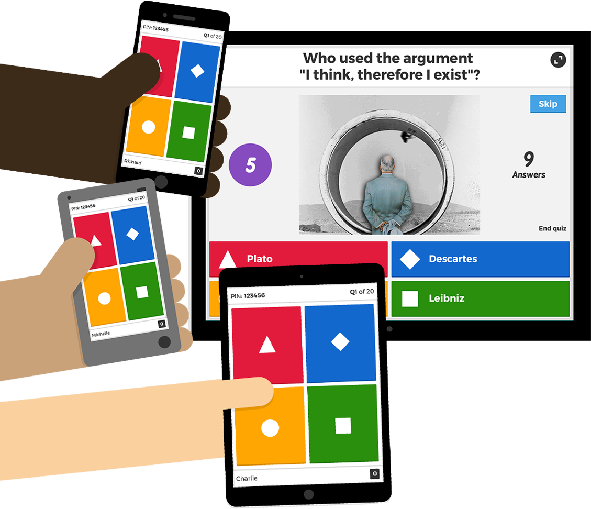

# Utilización de Quizzes y Gamificación en el aula

## Resultados de un estudio sobre la utilización de quizzes y gamificación en el aula

_El siguiente [post](http://blog.getkahoot.com/post/67459251583/results-from-using-various-quiz-approaches-in-class) de Kahoot! Inventor and Educator in Residence, Alf Inge Wang (@drfinge), Profesor de Tecnología de Juegos de la Universidad Noruega de Ciencia y Tecnología ._

Existen muchos beneficios en la utilización de pruebas (quizzes) durante el desarrollo de una clase, como la evaluación del conocimiento de los estudiantes, la reflexión sobre lo que han aprendido, el hecho de que reciban retroalimentación sobre su comprensión, y los beneficios que genera “partir” una clase larga para realizar una actividad diferente. Pero, ¿realmente tiene influencia la manera en cómo se lleva a cabo la prueba en el aula?

Un proyecto de investigación sobre este tema se inició el otoño de 2013 en la Universidad Noruega de Ciencia y Tecnología (NTNU) para analizar el efecto del uso de tres enfoques diferentes durante el desarrollo de las clases:

1.  Ejecución de una prueba en papel.
2.  Utilizando los Clickers sistema estudiante de respuesta simples “sin juego.”
3.  Utilizando el entorno de aprendizaje basado en juegos Kahoot!

El estudio se realizó en la asignatura introductoria TDT4110, que se imparte a aproximadamente a 2.000 estudiantes cada año. Dado que el volumen de alumnos es tan grande, los estudiantes se dividen en cinco subgrupos de 500 estudiantes, que reciben las mismas clases. Se recogió información de tres grupos, tienen el mismo profesor enseñando la misma lección, pero variando la forma de realizar los quizzes en el aula. Todos los estudiantes participantes en el estudio hicieron una pre-prueba en papel sobre el tema de la clase antes de la misma e hicieron la misma prueba al final. La pre-prueba permitió ver lo mucho que los estudiantes habían aprendido durante el desarrollo de la clase. Adicionalmente, los estudiantes llenaron un cuestionario al final de la conferencia con preguntas acerca de su compromiso, la motivación y cómo experimentaron a la hora de realizar la prueba.

Los resultados mostraron que los estudiantes que hicieron la prueba basada en el juego (Kahoot!), aprendieron un 22% más de estudiantes sobre los que hicieron pruebas de papel, y un 52% más sobre los estudiantes que utilizan los transmisores del sistema estudiante-respuesta. Tengamos en cuenta, sin embargo, que los resultados del sistema de estudiante-respuesta Clickers no son fiables ya que se presentaron grandes problemas técnicos, lo que dio lugar a la falta de tiempo para hacer todo el cuestionario. Estos resultados también muestran que el uso de un sistema de estudiante-respuesta no mejora automáticamente el aprendizaje sobre las soluciones de papel. Es muy importante que la infraestructura técnica sea robusta y se utilice de una manera correcta.

Además, los resultados mostraron que los estudiantes que utilizan Kahoot! estaban un 25% más motivados por la prueba en comparación que con la prueba de papel, y un 21% más motivados sobre los estudiantes que utilizan el sistema de respuesta de estudiantes “sin juego.” Adicionalmente, los estudiantes que participaron con el cuestionario sobre Kahoot ! estuvieron, respectivamente, 12 % y 8 % más satisfechos al completar la prueba en comparación con el papel y el cuestionario sistema tipo clickers. El nivel de atención durante el desarrollo de la clase, fue respectivamente, 23% y 19% superior por los estudiantes que utilizaron Kahoot!.

Esto mismo ocurrió durante el desarrollo del quiz: Kahoot! fue un 46% más alto sobre los estudiantes que hacen la prueba de papel, y un 55% más alto sobre los estudiantes que utilizan el sistema de estudiante-respuesta. Por último, las ganas de hacerlo bien durante el examen fue un 22% más por los estudiantes que jugaron Kahoot! que por parte de los estudiantes que hicieron la prueba en el papel.

Para resumir los resultados, podemos decir que el uso de una herramienta de aprendizaje basado en el juego como la mencionada Kahoot! tiene un efecto significativo en la mejora del aprendizaje de los alumnos, de cómo se involucran y su motivación durante el desarrollo de las las clases mas teóricas. Los resultados también sugieren que un sistema de preguntas basado en el juego aumentará estos efectos en comparación con un sistema de respuesta de los estudiantes que no empleen uno de tipo lúdico. Podemos comparar estos resultados por la simple observación de cuántos estudiantes participan en este tipo de actividades durante una clase. Tras varias experiencias usando Kahoot! y el sistema de transmisores durante todo un semestre, se vio que cuando Kahoot! fue utilizado, de promedio, más del 90% de los estudiantes participaban en la prueba. Cuando se utilizó el sistema de transmisores (sin ningún tipo de problemas técnicos), un promedio de 50 a 60 % de los estudiantes participaron. En las encuestas que se ha pedido a los estudiantes sobre cómo estos sistemas funcionan para dar una clase, es obvio que el factor _competitivo_ de esta herramienta realmente atrae a los estudiantes para hacer la prueba.

Fuente de la imagen: [Kahoot!](https://getkahoot.com/how-it-works)

Guardar