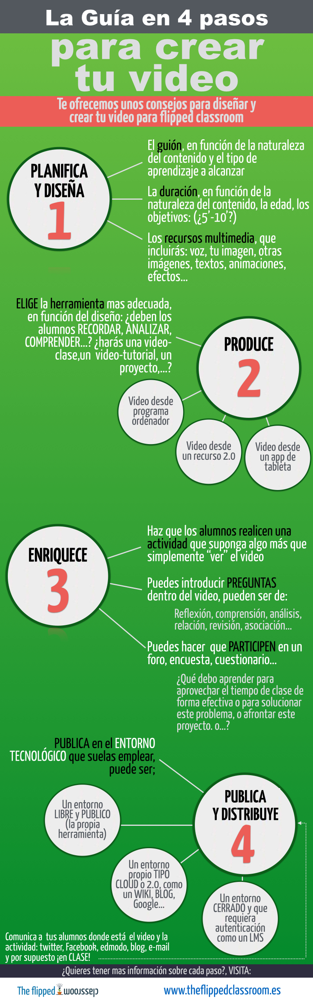

# Vídeos flipped

## Primeros consejos

De entre las muchas herramientas útiles para Flipped Classroom, quizá la que más uses sea el vídeo, por ello nos vamos a centrar en esta sección en cómo crear vídeos y enriquecerlos con elementos interactivos.

Antes de comenzar a crear tu video para flipped, te damos unos consejos previos. Tras estudiarlo, pregunta en el foro si te surge alguna duda.

Fuente de la imagen: [Blog The Flipped Classroom](http://www.theflippedclassroom.es/4-recomendaciones-para-que-produzcas-tu-primer-video-flipped/)

Guardar

## Herramientas

Échale un vistazo al [Espacio de Apoyo TIC](http://formacion.educalab.es/mod/book/view.php?id=18530) del curso para ver más herramientas aparte de las comentadas en las siguientes secciones.