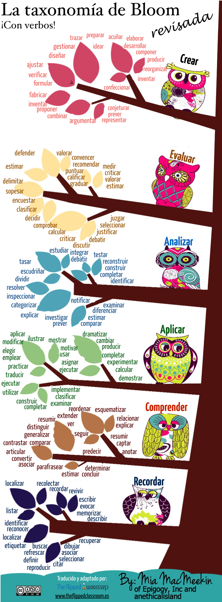
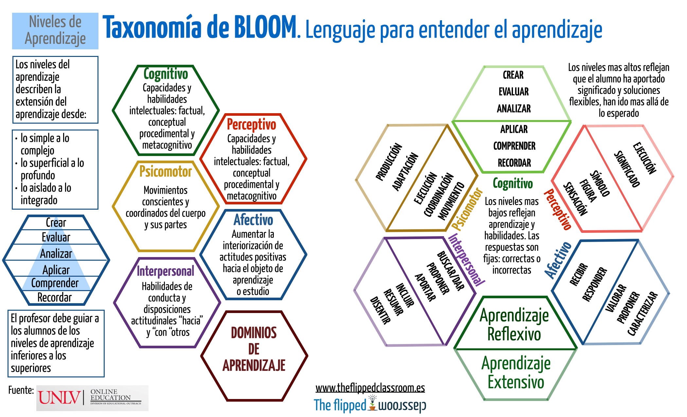

# Verbos y lenguaje para entender el aprendizaje

## Bloom y verbos que identifican las fases

Fuente de la imagen: [Blog The Flipped Classroom](http://www.theflippedclassroom.es/la-taxonomia-de-bloom-revisada-y-con-una-buena-coleccion-de-verbos/)

## La taxonomía de Bloom, un lenguaje para entender el aprendizaje

Fuente de la imagen: [Blog The Flipped Classroom](http://www.theflippedclassroom.es/la-taxonomia-de-bloom-un-lenguaje-para-entender-el-aprendizaje/)